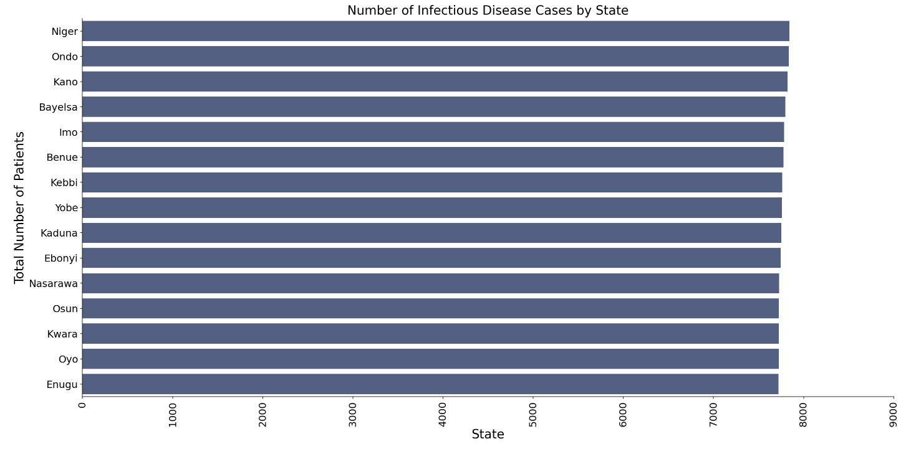
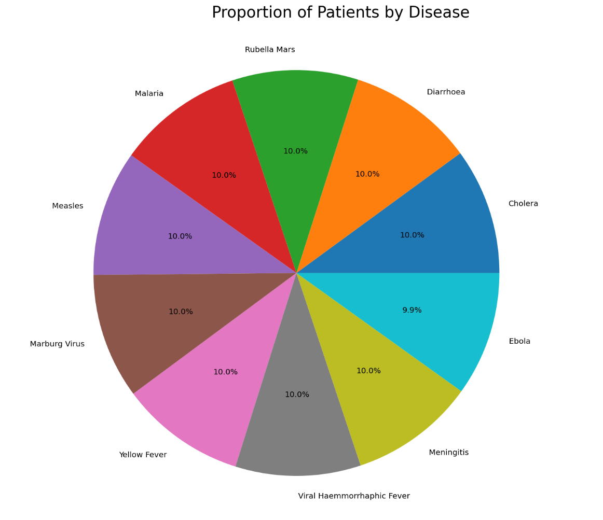
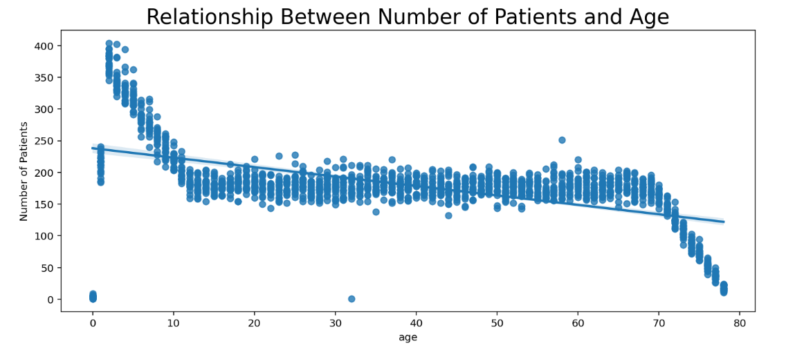

## Overview

Infectious diseases remain one of the major public health challenges in Nigeria, affecting people across all age groups and regions.  
This project explores patterns and trends in reported disease cases using a national dataset containing demographic, geographic, and clinical information.  

The dataset includes key variables such as:
- Disease type  
- Serotype (for meningitis)  
- Patient age and gender  
- Health status (alive or dead)  
- Reporting location and year  

By analyzing this data, the project aims to highlight the most prevalent diseases, regional variations, and demographic patterns associated with disease occurrence and outcomes.

---

## Aim

The aim of this project is to analyze patterns and trends in reported infectious diseases across Nigeria, focusing on demographic, spatial, and clinical factors that influence disease occurrence and outcomes.

---

## Dataset Description

The dataset (`meningitis_dataset.csv`) contains detailed case reports from multiple Nigerian states.  
It covers several infectious diseases such as **cholera, diarrhoea, measles, malaria, meningitis, yellow fever, and Ebola**.  

Each record includes:
- Patient demographics (age, gender)
- Settlement and state information
- Disease type and health outcome
- Reporting year and date
- Serotype classification (for meningitis only)

---

## Data Analysis and Visualization

### 1. Age Group Distribution
This visualization shows the age group distribution of the dataset.

### 2. Disease Distribution by State
This visualization shows the total number of patients per disease across Nigerian states.  
It highlights regional hotspots and areas with the highest disease burden.

---

### 3. Disease Distribution by Settlement
This chart compares disease occurrence between **rural** and **urban** areas, helping identify community-level differences in infection patterns.

---

### 4. Disease Trends by Year
Yearly distribution of disease cases across states, showing how the number of reported cases changes over time.

---

### 5. Overall Disease Proportions
A pie chart displaying the proportion of each disease among all reported cases.  
It clearly shows that **cholera** and **diarrhoea** dominate reported infections.

---

### 7. Disease Distribution by Age
These charts and scatter plots show how disease frequency and survival outcomes vary across age groups, offering insights into which diseases affect children or adults more severely.

---

### 7. Serotype Distribution
This analysis focuses on the **serotype** variable.  
Since only meningitis had valid serotype data (all others were null), the chart displays meningitis serotypes and their patient counts.  
It provides insight into the most frequently occurring strains.

---

## Key Findings

- **Cholera and diarrhoea** were the most frequently reported diseases.  
- **Ebola** had the lowest case numbers among all listed diseases.  
- **Settlement type** (urban vs rural) showed almost no correlation with disease occurrence.  
- **Gender distribution** was fairly balanced, though some diseases slightly affected one gender more.  
- **Age analysis** revealed infections across all age groups, with some clustering among younger patients.  
- **Serotype data** was limited to meningitis, highlighting gaps in pathogen classification for other diseases.

---

## Conclusion

The analysis demonstrates that infectious diseases remain widespread across Nigeria, with significant variation by disease type and location.  
Cholera and diarrhoea were the leading causes of infection, while data completeness — especially in serotype and health outcome reporting — remains an area needing improvement.  
The findings provide a foundation for targeted public health strategies and improved data collection systems.

---

## Recommendations and Next Steps

1. **Improve Data Quality**  
   - Strengthen reporting systems and reduce missing entries, especially for serotype and disease outcome fields.  

2. **Enhance Surveillance Systems**  
   - Expand health monitoring infrastructure in rural and underreported regions.  

3. **Conduct Deeper Analyses**  
   - Integrate socio-economic and environmental variables (e.g., water quality, sanitation).  
   - Apply spatial mapping to identify and visualize high-risk areas.  

4. **Support Public Health Action**  
   - Promote sanitation and vaccination campaigns targeting high-risk diseases.  
   - Focus on early detection and response measures for outbreaks.

---

## Tools and Libraries

- **Python**  
- **Pandas** – Data cleaning and manipulation  
- **Matplotlib** & **Seaborn** – Static and comparative plotting  
- **Jupyter Notebook** – Development and presentation environment  

---

**Notebook File:**  
[`Infectious Disease In Nigeria Project.ipynb`](./Infectious%20Disease%20In%20Nigeria%20Project.ipynb)

*Dataset:**  
[`meningitis_dataset.csv`](./meningitis_dataset.csv)

